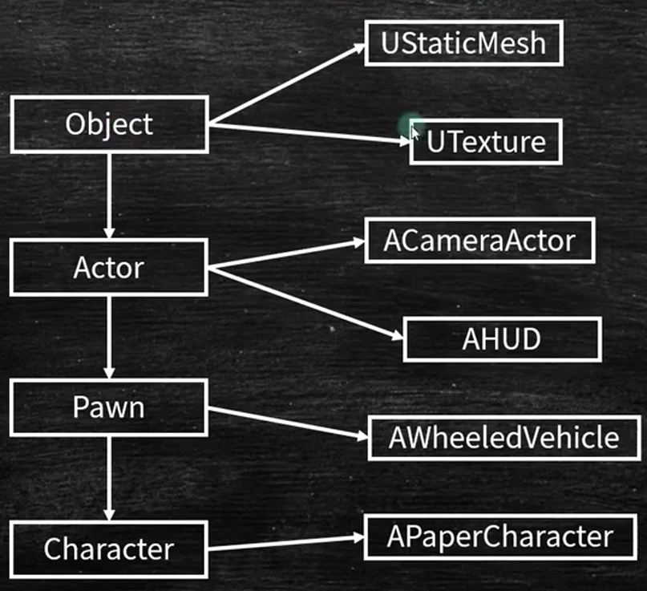

[toc]

资料来源：
https://docs.unrealengine.com/4.27/zh-CN/Basics/UnrealEngineTerminology/
# 1 蓝图
蓝图可视化脚本（Blueprint Visual Scripting） 系统（或缩写 蓝图（Blueprints））是一种功能齐全的游戏脚本系统，它允许你在虚幻编辑器（Unreal Editor）中通过基于节点的界面来创建游戏元素。和许多常见脚本语言一样，你可以用它在引擎中定义面向对象的类或对象。在使用UE4时，你会发现使用蓝图定义的类一般也统称蓝图
# 2 Actor
所有可以放入关卡的对象都是 Actor，比如摄像机、静态网格体、玩家起始位置。Actor支持三维变换，例如平移、旋转和缩放。你可以通过游戏逻辑代码（C++或蓝图）创建（生成）或销毁Actor。
在C++中，AActor是所有Actor的基类。

# 3 Component
当你为Actor添加组件后，该Actor便获得了该组件所提供的功能。例如：
聚光灯组件（Spot Light Component）允许你的Actor像聚光灯一样发光，
旋转移动组件（Rotate Movement Component）能使你的Actor四处旋转，
音频组件（Audio Component）将使你的Actor能够播放声音。
组件必须绑定在Actor身上，它们无法单独存在。