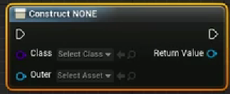
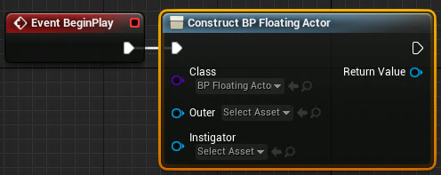

[toc]
# 1 创建C++类
1. 单击选中在内容浏览器下的```C++类```-->工程同名文件夹
   如果没有```C++类```这个目录，可以点击Unreal编辑器右下角的```视图选择项```，勾选```显示C++类```
2. 在内容浏览器下的```过滤器```中，在空白处右击，选择```新建C++类```
3. 根据提示选择创建C++类的父类
4. 根据提示给创建的类起名字和选择路径，一般选择$(工程根目录)/Source/$(工程名)/
5. 点击```创建类```即可。创建的C++类可以在所选择的路径下找到，并在其中编写代码

# 2 创建蓝图
创建蓝图之前，一般在Content目录下创建一个新的存放蓝图的文件夹Blueprints(非硬性要求)
## 2.1 基于C++类上创建蓝图
1. 在```内容浏览器```上中的```C++类```点击选中我们创建的C++类。
2. 右击，选择```创建基于xxx的蓝图类```
3. 然后根据提示给创建的蓝图类命名和设置存放路径后点击```创建蓝图类按钮```即可

## 2.2 创建关卡蓝图
**关卡蓝图**：每一个关卡有且仅有一张关卡蓝图。一般关卡蓝图用于测试、设置当前关卡一些独特的内容、摄像机转换等。
打开关卡蓝图, 需要点击Unreal编辑器工具栏中的```蓝图```，选择```打开关卡蓝图(Open Level Blueprint)```
### 2.2.1 关卡蓝图---BeginPlay
在关卡蓝图中，右击后搜索```BeginPlay```后会创建BeginPlay事件节点，这是游戏开始的时候，由Unreal进行调用。
### 2.2.2 关卡蓝图---实例化Objiect类
```Construct Object from class```用于实例化继承自Object的C++类.

1. 在```Select Class```选择需要实例化的类
2. 在```Outer```处选择输出成什么资源，一般还是选择跟Class处一致
3. 在Return Value处可以直接调用所选类的函数或者提升为变量(Promote to variable)，然后在后面调用。

如果在第2步选择实例化类的时候，选择了继承自```AActor```的类，则会变成

- 在Instigator中选择对应的UI对象.
- 按住alt键，点击节点之间的连接线可以断开连接

# 3 删除自定义的C++类
1. 关闭Unreal
2. 在```$(工程根目录)/Source/$(工程名)/```下将我们创建的C++类的头文件和cpp文件删除
3. 删除```$(工程根目录)/Binaries/```目录（包括Binaries）
4. 如果Unreal是运行在Windows下，那么右击```$(工程根目录)/$(工程名).uproject```文件，选择```Genarate Visual Studio project files```。(该步骤非必须，如果不做，那在打开Unreal的时候，也会要求去做)
5. 重新打开Unreal，如果没有做第4步，会提示要求做