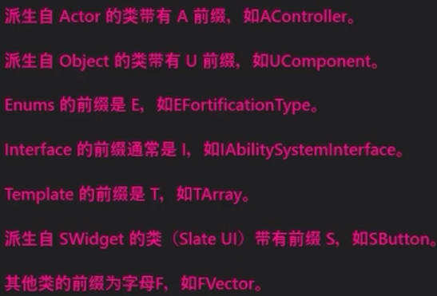
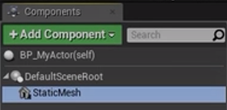
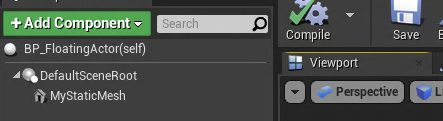

[toc]
来源：https://docs.unrealengine.com/4.27/en-US/ProgrammingAndScripting/ProgrammingWithCPP/CPPProgrammingQuickStart/
# 1 创建Actor的C++类
- 在虚幻编辑器中，单击**文件**下拉菜单，然后选择新建**C++**类...命令。
- 将显示“**选择父类**”菜单。您可以选择要扩展的现有类，将其功能添加到您自己的类中。选择**Actor**，因为它是可以放置在世界中的最基本的对象类型，然后单击**下一步**。
- 在“命名您的新Actor”菜单中，将“Actor”命名为自己想要创建的C++类名，然后单击“创建类”。
- 创建好后就可以在创建C++类时指定的路径下，创建好的C++类继承自AActor类。
创建好的类头文件为：
```c++
#pragma once
#include "CoreMinimal.h"
#include "GameFramework/Actor.h"
#include "FloatingActor.generated.h" // 必须写在其他include之后

UCLASS() // 表明该类要参与反射与垃圾回收系统，需要包含$(类名).generated.h头文件
class STATING_API AFloatingActor : public AActor
{
	GENERATED_BODY()
public:	
	// Sets default values for this actor's properties
	AFloatingActor();
protected:
	// Called when the game starts or when spawned
	virtual void BeginPlay() override;s
public:	
	// Called every frame
	virtual void Tick(float DeltaTime) override;
};
```

Unreal引擎中的类的命名方式：


当我们创建好自己编写的C++类后，在```内容浏览器```中选择创建好的C++类，然后右击，选择```Create Blueprint class based on xxx```来创建蓝图。
蓝图类可以扩展C++类的功能。并且如果C++类中没有内容时，创建蓝图时Unreal引擎会自动添加一个根组件。添加了组件的蓝图类可以被拖进视口窗口中。
**组件**：组件继承自UObject. 可以给Actor以及可以在场景中显示出来的类增加一些特定的功能。能放在场景中的类都需要有一个默认根组件```DefaultSceneRoot```, 根组件用于标识类在视口中的三维位置以及其他功能。
创建的蓝图类可以拖到视口中，并体现为一个球体。但这个球体在运行的时候会消失，这只是在设计的时候方便我们设计。

我们可以手动给创建的蓝图添加一个组件---在Components窗口添加

添加后在这个根组件中创建添加的组件，在蓝图编辑界面，可以点击按住子组件去替换根组件。


# 2 AActor类的类型
## 2.1 UStaticMeshComponent类型
UStaticMeshComponent将充当我们对象的可视化表示。可以通过函数
```c++
CreateDefaultSubobject<UStaticMeshComponent>(TEXT("Mesh"));
```
来创建其指针

# 3 AActor类中方法作用
## 3.1 BeginPlay
```
void BeginPlay();
```
在游戏开始的时候执行，可用于初始化，可以重写
## 3.2 Tick
```c++
void Tick(float DeltaTime);
```
**作用**:在游戏每一帧时调用一次，，可以重写
**参数**:
- DeltaTime: 上一帧到本帧的时间

## 3.3 CreateDefaultSubject
```c++
template<class TReturnType>
TReturnType* CreateDefaultSubject(FName SubjectName, bool bTransient = false);
```
**作用**: 创建一个默认的组件。如果在创建的C++类中调用了这个函数。那么在基于该C++类创建蓝图的时候，添加的组件就是这个函数返回值对应的组件，组件名称为返回值所对应的变量名。
**参数**：
- SubjectName: 该组件在系统中的一个标识，不可重复
- bTransient: 

## 3.4 SetActorLocation
```c++
bool SetActorLocation(
	const FVector& NewLocation, 
	bool bSweep=false, 
	FHitResult* OutSweepHitResult=nullptr, 
	ETeleportType Teleport = ETeleportType::None)
```
**说明**:设置组件的位置
**删除**：
- NewLocation：设置的新位置
- bSweep: 是否扫描
- OutSweepHitResult：击中的结果
- Teleport： 

**示例1**：
```c++
void AFloatingActor::BeginPlay()
{
	Super::BeginPlay();

	// 开始时默认设置为(0,0,0)
	FVector location(0.0f);
	SetActorLocation(location);
}
```


# 4 AActor类中的变量
## 4.1 PrimaryActorTick
```c++
// 该变量定义在AActor类中
struct FActorTickFunction PrimaryActorTick;
```
|FActorTickFunction内部变量名|类型|说明|
|---------------------------|----|----|
|bCanEverTick|uint8|配置每一帧是否调用Tick方法。1:每一帧调用，0:不调用Tick|

# 5 代码示例
C++类的头文件
```c++
#pragma once
#include "CoreMinimal.h"
#include "GameFramework/Actor.h"
#include "FloatingActor.generated.h"

UCLASS(Blueprintable) // Blueprintable表明可以在蓝图中访问，可以使用反射
class STATING_API AFloatingActor : public AActor
{
	GENERATED_BODY()
public:	
	// Sets default values for this actor's properties
	AFloatingActor();
protected:
	// Called when the game starts or when spawned
	virtual void BeginPlay() override;
protected:

	/*声明一个静态组件*/
	UPROPERTY(VisibleAnyWhere)
	UStaticMeshComponent* VisualMesh;

	UPROPERTY(BlueprintReadWrite, Category="MY")  // BlueprintReadWrite指明可以在蓝图中读写
	float MyFloat;

	UFUNCTION(BlueprintCallable)  // BlueprintCallable表明可以在蓝图中调用
	void MyFunction();
public:	
	// Called every frame，DeltaTime是上一帧到本帧所用的时间
	virtual void Tick(float DeltaTime) override;
};
```

C++源文件
```c++
#include "FloatingActor.h"

// Sets default values
AFloatingActor::AFloatingActor()
{
	// 如果为true, 那么每一帧都会去调用Tick函数，否则就不会调用Tick
	PrimaryActorTick.bCanEverTick = true;

	if(USceneComponent* ExistingRootComponent = GetRootComponent()){
		VisualMesh = CreateDefaultSubobject<UStaticMeshComponent>(TEXT("Mesh"));
		VisualMesh->SetupAttachment(RootComponent);
		static ConstructorHelpers::FObjectFinder<UStaticMesh> CubeVisualAsset(TEXT("/Game/Content/StarterContent/Shapes/Shape_Cube.Shape_Cube"));

		if(CubeVisualAsset.Succeeded()){
			VisualMesh->SetStaticMesh(CubeVisualAsset.Object);
			VisualMesh->SetRelativeLocation(FVector(0.0f, 0.0f, 0.0f));
			UE_LOG(LogTemp, Log, TEXT("find a cube"));
		}else{
			UE_LOG(LogTemp, Error, TEXT("not find a cube"));
		}
	}
}

// Called when the game starts or when spawned
void AFloatingActor::BeginPlay()
{
	Super::BeginPlay();
}

// Called every frame
void AFloatingActor:: (float DeltaTime)
{
	Super::Tick(DeltaTime);

	// 实现立方体的上下移动并旋转
	FVector NewLocation = GetActorLocation();
	FRotator NewRotation = GetActorRotation();
	float RunningTime = GetGameTimeSinceCreation();
	float DeltaHeight = (FMath::Sin(RunningTime + DeltaTime) + FMath::Sin(RunningTime));
	NewLocation.Z += DeltaHeight * 20.0f;
	float DeltaRotation = DeltaTime * 20.0f;
	NewRotation.Yaw += DeltaRotation;
	SetActorLocationAndRotation(NewLocation, NewRotation);
}

void AFloatingActor::MyFunction(){
	UE_LOG(LogTemp, Log, TEXT("hello world!"));
	UE_LOG(LogTemp, Warning, TEXT("hello world!"));
	UE_LOG(LogTemp, Error, TEXT("hello world!"));
}
```