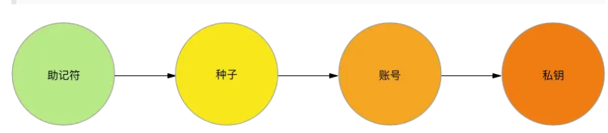

[toc]

# 1 OKChain介绍

- 技术架构：OKChain基于Tendermint共识算法和Cosmos SDK开发框架构建。Tendermint采用权益证明(PoS)共识机制，具有高吞吐量和快速确认的特点，可以实现快速的交易处理和区块生成。Cosmos SDK提供了开发区块链应用的工具和模块，使开发者可以构建自己的定制化区块链应用。

https://www.delicacydaily.com/cn/oktc

开发指南：
https://www.ouxyi.club/cn/oktc/docs/dev/quick-start/overview

okx官网：
https://www.okx.com/cn

web3钱包安装攻略
https://www.okx.com/cn/learn/how-connact-okx-wab3-wallet

<font color=red>注意</font>
- https://www.okex.me/  网址不可信

git获取
git clone -b mainnet https://github.com/okx/exchain

# 2 安装OKTC工具
参考网址：https://www.delicacydaily.com/cn/oktc/docs/dev/quick-start/install-oktc
```shell
# 获取下载OKT工具C
git clone https://github.com/okx/exchain

# 开启GO module
export GO111MODULE=on

cd exchain 

# 安装前置
make rocksdb

# 编译主网
make mainnet

# 编译测试网
make testnet
```

**注意**:
- OKTC要求go环境且版本在1.17及其以上。执行make命令的时候又可能会提示需要更高的go版本。

**验证是否安装成功**：
```shell
exchaind version --long
exchaincli version --long
```

# 3 安装go开发工具包
```shell
go get github.com/okx/exchain-go-sdk
go get github.com/okex/exchain-go-sdk
go get github.com/okex/exchain-go-sdk/utils
```
**注意**：
- go.mod的内容参考下载的github.com/okex/exchain-go-sdk包的go.mod.
（踩坑，go mod tidy各种报错，将go.mod的内容修改为github.com/okex/exchain-go-sdk下的go.mod后，再进行go mod tidy就好了）
```go
module github.com/okex/exchain-go-sdk

go 1.16

require (
    github.com/bartekn/go-bip39 v0.0.0-20171116152956-a05967ea095d
    github.com/ethereum/go-ethereum v1.10.8
    github.com/golang/mock v1.6.0
    github.com/kr/pretty v0.2.1 // indirect
    github.com/minio/highwayhash v1.0.1 // indirect
    github.com/okex/exchain v1.6.4
    github.com/prometheus/client_golang v1.8.0 // indirect
    github.com/stretchr/testify v1.8.0
    golang.org/x/net v0.0.0-20210903162142-ad29c8ab022f // indirect
)

replace (
    github.com/ethereum/go-ethereum => github.com/okex/go-ethereum v1.10.8-oec3
    github.com/gogo/protobuf => github.com/regen-network/protobuf v1.3.3-alpha.regen.1
    github.com/tendermint/go-amino => github.com/okex/go-amino v0.15.1-okc4
)
```

# 3 概念和名词

- **TPS**： 每秒交易单数
- **Dpos**： 委托权益证明
- **Bech32**: 比特币地址。
比特币地址是一串数字和字母，用于接收比特币的地方。它类似于银行账户的账号，只不过是一种数字形式的账号。比特币地址由数字和字母组成，长度为27-34个字符。每个比特币地址都是唯一的，因此您不必担心将其与其他人混淆。当您想要接收比特币时，您只需要告诉别人您的比特币地址即可。如果别人向您发送比特币，它们会在区块链网络上被广播，然后发送到您的比特币地址。
比特币地址主要分为三种格式：Legacy（传统地址）、Segwit（隔离见证地址）和Bech32（比特币原生隔离见证地址）。
1.**Legacy（传统地址）**：以“1”开头，长度为26-35个字符。这是比特币最早的地址格式，也是最常用的格式。传统地址在普通转账时费用较便宜，但在使用多重签名（multisig）和隔离见证（segwit）等高级功能时会存在一些问题。
2.**Segwit（隔离见证地址）**：以“3”或“bc1”开头，长度为27-34个字符。Segwit是比特币网络中的一项技术创新，旨在解决比特币网络中的一些问题，如拥堵和高交易费用。Segwit地址可以帮助减少交易费用，并提高交易确认速度。
3.**Bech32（比特币原生隔离见证地址）**：以“bc1”开头，长度为42个字符。这是比特币最新的地址格式，是使用隔离见证的最佳方式。由于它更短，更易于识别，并且更安全，因此越来越多的比特币用户开始使用Bech32地址。</br>
除了地址格式之外，比特币地址还可以通过使用多重签名（multi-sig）来提高安全性和可控性。多重签名是一种用于在比特币交易中签名的策略，需要多个密钥才能进行签名，从而使交易更为安全。

4. **助记符（mnemonic）**：按照一定顺序排列的单词，是恢复钱包的唯一手段。如果你对比特币有一定的了解，当你在看到这些助记符时肯定会产生疑惑，因为通常人们理解的是：只有私钥才需要保管，且只有私钥才能恢复钱包，但创建钱包时并没有要求你保存私钥，而是记录一些助记符，那么我们很容易的做出推断——私钥和助记符之间一定有着某种联系。

用算法生成助记符，再通过助记符产生种子,用种子算出一个账号数据,通过这个账号，可以产生无数个私钥.
只要种子不变，通过种子算出的账号也是不变的。你可以给每个产生的私钥分配一个序号，例如0、1、2等，只要序号确定，那么私钥的数值就是一定的。这也是为什么我们可以在钱包里创建多个账号的原因，这么多账号虽然都各自拥有一对公、私钥，但我们只需要一个种子，就可以把它们全部恢复，保存种子比直接保存私钥效率要高很多。


# API接口文档地址
https://www.delicacydaily.com/cn/oktc/docs/dev/api/oktc-api/http