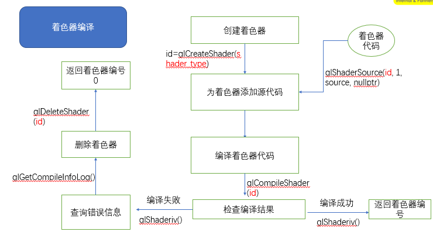

[toc]
# 1 创建着色器流程


# 2 创建着色器相关的API
## 2.1 glCreateShader
**函数原型**：
```c++
// 创建一个空的着色器对象，并返回一个可以引用的非零值(shader ID)
GLuint glCreateShader (GLenum type);
```
**参数**：
- **<font color="green">type</font>**: 创建着色器的类型：
  GL_VERTEX_SHADER:顶点着色器，
  GL_FRAGMENT_SHADER:片段着色器

**返回值**：
正常返回一个大于0的值，失败返回0

## 2.2 glShaderSource
**函数原型**:
```c++
// 替换着色器对象中的源代码,先前存储在着色器对象中的任何源代码都将被完全替换
void  glShaderSource (GLuint shader,
                      GLsizei count,
                      const GLchar *const*string,
                      const GLint *length);
```
**参数**:
- **<font color="green">shader</font>**：着色器的ID <font color="gray">(由glCreateShader返回)</font>
- **<font color="green">counts</font>**: 着色器的个数
- **<font color="green">string</font>**: 着色器代码
- **<font color="green">length</font>**: 指定字符串长度的数组。如果length为NULL，则认为每个字符串都以null结尾, 如果length不是NULL，则它指向包含字符串的每个相应元素的字符串长度的数组.

**错误值**:
- GL_INVALID_OPERATION：不支持着色器编译器
- GL_INVALID_VALUE：shader不是OpenGL生成的值
- GL_INVALID_OPERATION：shader不是着色器对象
- GL_INVALID_VALUE：count比0小