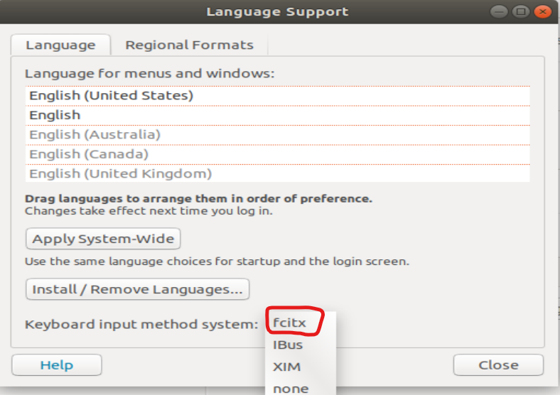
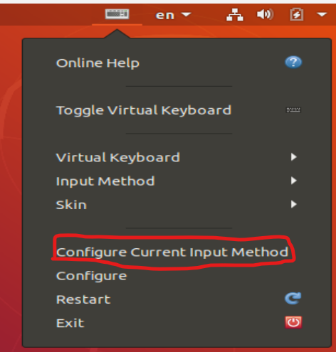
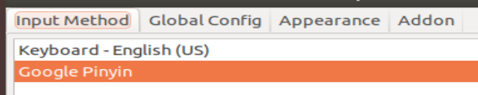
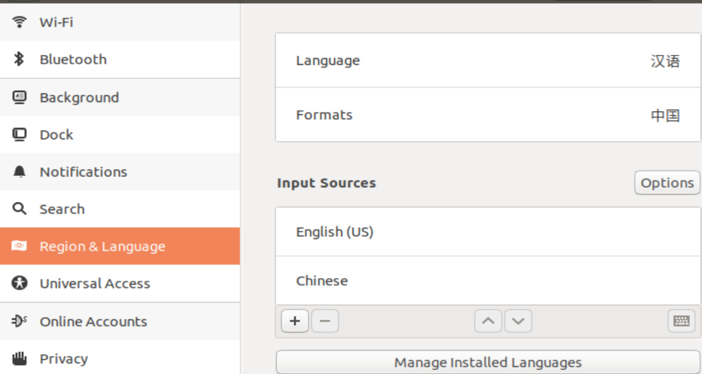

[toc]
# 1 安装的环境
## 1.1 git环境
```shell
# ssh-keygen -t rsa -C "your_emial@examle.com" 生成ssh公钥
sudo apt-get install ssh

# git config --global user.name jake
# git config --glocal user.email "1945656328@qq.com"
sudo apt-get install git
```

## 1.2 编码环境
```shell
sudo apt-get install gcc
sudo apt-get install make
sudo apt-get install cmake
sudo apt-get install g++
sudo apt-get install vim
```

## 1.3 中文输入法
```shell
sudo apt-get install fcitx-bin
sudo apt-get install fcitx-table
sudo apt-get install fcitx-googlepinyin
```
安装后在设置-->Region & Language-->Manage Installed Language 选择fcitx

重启后，在右上角的键盘图标点击-->选择Configure Current Input Method. 选择Google Pinyin. 之后就可以ctr+空格来切换中英文输入了。



## 1.4 redis环境
```shell
# 下载redis源码
wget http://download.redis.io/releases/redis-5.0.0.tar.gz

#解压
tar -xvf redis-5.0.0.tar.gz

# 进入目录中编译
make

# 安装
sudo make install
```

## 1.6 压缩/解压工具
```shell
# zip工具
sudo apt-get install zip
```

## 1.7 openGLES环境
```shell
# png图片解析
sudo apt-get install libpng-dev
sudo apt-get install libsoil-dev libglm-dev libassimp-dev libglew-dev libglfw3-dev libxinerama-dev libxcursor-dev libxi-dev libgles2-mesa-dev libtinyxml2-dev
# 安装字体解析库
sudo apt install libfreetype6-dev
```

# 2 配置ubuntu虚拟机遇到的问题
## 2.1 打不开终端
现象： 右键选择open terminate打不开终端
解决之法：在设置中的Region & Language中将language和format分别改为汉语和中国。然后选择restart

