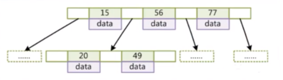
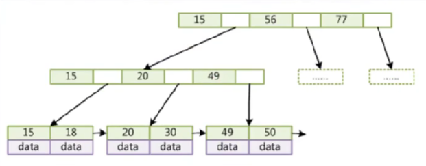
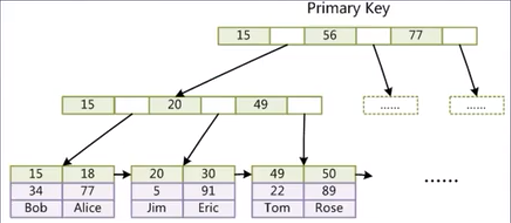
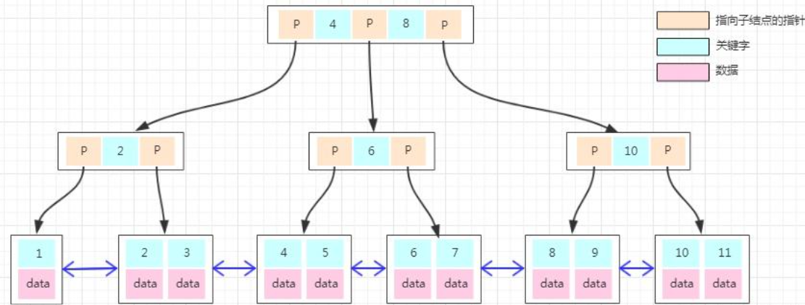
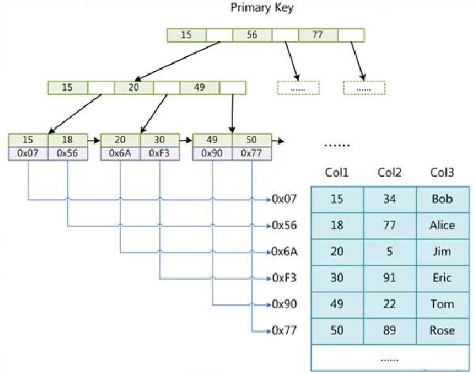

[toc]
# 1 索引介绍
MySQL索引的建立对于MySQL的高效运行是很重要的，索引可以大大提高MySQL的检索速度。
创建索引时，你需要确保该索引是应用在 SQL 查询语句的条件(一般作为 WHERE 子句的条件)。
实际上，索引也是一张表，该表保存了主键与索引字段，并指向实体表的记录。
缺点：虽然索引大大提高了查询速度，同时却会降低更新表的速度，如对表进行INSERT、UPDATE和DELETE。因为更新表时，MySQL不仅要保存数据，还要保存一下索引文件。

建立索引会占用磁盘空间的索引文件。
# 2 添加索引
## 2.1 添加索引
```sql
CREATE INDEX <indexName> ON <table_name> (column_name)
```
示例：
```sql
# 给book表添加name索引，索引名为idx_name
create  index idx_name ON book(name);

# 给book表添加name,age的联合索引，索引名为idx_name
create  index idx_name ON book(name，age);
```
## 2.2 创建时添加索引
在创建索引的时候也可以添加索引
```sql
CREATE TABLE mytable(  
    `ID` INT NOT NULL,   
    `username` VARCHAR(16) NOT NULL,  
    primary key(ID)
    INDEX <indexName> (username(length))  
)engine=InnoDB default charset=utf8;  
```
注意对于varchar类型的字段，创建索引的时候要跟上用作索引的长度length，那么该字段的前length个字符就会被当作索引

## 添加唯一索引
添加唯一索引后，成为索引的那个字段不允许有重复的值
```sql
# 给book表添加name索引，索引名为idx_name
create unique index idx_name ON book(name);

# 给book表添加name,age的联合索引，索引名为idx_name
create unique  index idx_name ON book(name，age);

# 在创建表的时候添加唯一索引
create table if not exists `tt`( 
    id INT AUTO_INCREMENT, 
    name CHAR(12), 
    UNIQUE INDEX (name), # 添加唯一索引
    PRIMARY KEY (id)
)engine=InnoDB default charset=utf8;
```

# 3 索引的底层原理
## 3.1 B+树
数据库存储索引的数据结构是B+树，之所以不用红黑数或二叉树，是因为在大数据下，红黑树的高度会变得不可控；二叉树在顺序插入的情况下会退化成链表。
在说B+树之前，先看看B树
**B树**：
- 叶节点具有相同的深度，叶节点的指针为空
- 所有索引元素不重复
- 叶节点的数据索引从左到右递增排列

由此可见B树的一个节点上有多个元素，元素的值从左到右递增，这样可以有效控制树的高度。 

**B+树**：
- 非叶子节点不存储data，只存储索引(冗余)，可以放更多的索引
- 叶子节点包含所有索引字段
- 叶子节点用指针连接，提高区间访问的性能


图中的数字是索引，空格是存储指向下一个节点的指针。MySQL给B+树的节点设置的大小是16Kb, 给指向子节点的指针分配的内存占6字节。一般来说采用的主键索引类型是bigint(占8字节)。由此可以计算出一个节点可以存放约1170个索引，如果B+树的高度为3(设叶子节点的data占1字节)，那么整颗树可以存储的索引个数为1170x1170x16 = 21902400。 这样只需要一个高度为3的B+树就可以存储2千多万条索引，而且一般来说，MySQL的B+树根节点是常驻内存的，因此查找时可以减少一次磁盘IO

B+树相对于B树来说，进行了2个改造：
- B+s树将B树节点的数据移到了叶子节点，因此同等高度下，B+树存储的数据量大于B树
- B+树给叶子节点之间添加了双向指针，提高了范围查找的查找效率。B树如果要进行范围查找还需要回溯到父节点然后再寻子节点，而B+树直接通过叶子节点的指针进行范围查找。

MySQL存储引擎之所以选择B+树而不是B树，也是因为以上两点


# 4 聚集索引
聚集索引的索引和数据是存放在同一个文件中的，例如MySQL中的InnoDB存储引擎用的就是聚集索引。

对于InnoDB, 索引和数据信息存储在.ibd文件下，表的结构信息存储在.frm文件下。
InnoDB表必须要有索引并且推荐使用整形自增主键，如果创建表的时候没有指定主键，那么会使用一个隐藏列来作为主键，从而来组织B+树。

之所以推荐使用整形自增的值作为主键，而不是用uuid。
- 在查找过程中需要频繁的比较大小，通过整型的比较要比字符串比较更高效
- 整型所占用的空间比uuid小
- 使用自增属性，再插入的时候可以更快速的插入。如果不是按升序插入，B+树在插入的时候更容易分裂，降低插入效率

**扩展**：
MySQL底层存储数据结构除了可以用B+树来组织外，还可以用Hash<font color=gray>(MyISAM和InnoDB存储引擎只支持BTREE索引；MEMORY和HEAP存储引擎可以支持HASH和BTREE索引)</font>。使用Hash可以通过Hash运算很快地将要查找的索引获取到对应的存储地址，其查找效率要不B+树查找更高。但Hash对于范围查找不能很好的支持。因此几乎所有的MySQL数据库都用的B+树来组织的数据结构。而B+树就能很好的支持范围查找
因为B+树的叶子节点之间也是通过**双向指针**连接起来的，而且从左到右依次递增。当我们找到一个索引的叶子节点时，如果要查找比它大的索引，只需要通过叶子节点之间的指针就可以快速地找到。



# 5 非聚集索引
非聚集索引的的索引文件和数据文件是分离的，比如MySQL的MyISAM存储引擎用的就是非聚集索引

对于MyISAM存储引擎，索引是存储在.MYI文件下，数据是存储在.MYD文件下，表结构信息存储在.frm文件下。如上图中，存储索引的B+树下的叶子节点存储的是指向对应数据的磁盘文件地址。

# 6 联合索引
联合索引就是2个以上的字段联合起来的索引。
**创建联合索引**：
```sql
REATE TABLE IF NOT EXISTS `test`( 
    id INT AUTO_INCREMENT, 
    `name` CHAR(21) NOT NULL,
     `age` TINYINT NOT NULL, 
     PRIMARY KEY (id), 

     # 创建name,age的联合索引，索引名为idx_name_age, 也可以不写索引名
     KEY `idx_name_age` (name,age) USING BTREE 
)ENGINE=INNODB DEFAULT CHARSET=utf8 COMMENT="ttt";
```
通过联合索引构建B+树时，排序方式是先比较第一个字段，如果第一个字段的值相同，再比较下一个字段。比如以上的创建的联合索引中，进行比较时，先比较name字段，再比较age字段

# 7 唯一联合索引
唯一联合索引是在联合索引的基础上，限制作为索引的字段组合的值不能重复
**创建唯一联合索引**：
```sql
create table if not exists `ttt`(
     id int auto_increment, 
     name char(3),
      age int, 
      primary key(id), 

      # 创建唯一联合索引
      unique index `idx_name_age` (age,name)
)engine=InnoDB default charset=utf8 comment="test";
```