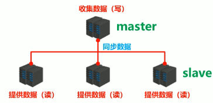
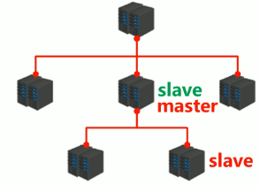
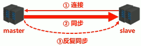
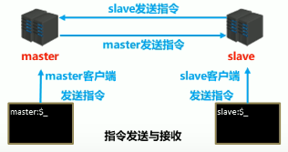
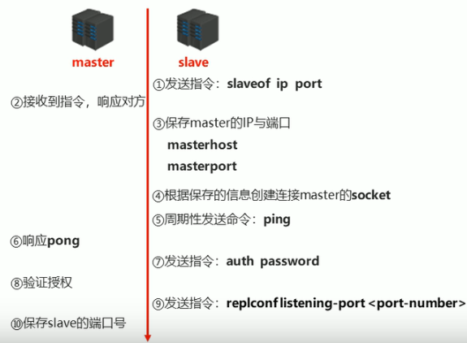

[toc]
# 1 主从复制简介
## 1.1 互联网"三高"架构
互联网架构有高并发、搞性能、高可用的特性。
**高并发**：我们所搭建的网络需要支持大量用户同时访问服务器的能力。
**高性能**: 处理请求的速度比较快
**高可用**: 服务器的可用性高
$可用性 = 一年对外提供服务总时间 \div 一年的时间 \times 100\% $
业界所追求的可用性为99.999%,即服务器年宕机时长低于315秒，约5.25分钟。
## 1.2 单机Redis的风险与问题
对于单机redis,有可能出现以下问题：
- 机器故障
   当单机redis服务器发送故障时，那么该服务就不可使用了。并且会伴随这数据丢失，可能对业务造成<font color=red>灾难性打击</font>。
- 容量瓶颈
   单机的redis服务器内存容量有限，且不能无限升级内存，因为穷且硬件条件跟不上。</br>

由此可见，单点Redis服务器一旦出现问题就很难解决。为了避免单点Redis服务器故障，准备多台服务器并互相连通。将数据复制多个副本保存到多台服务器上，它们<font color=red>连接在一起</font>保证数据的<font color=red>同步</font>。即使有其中一台服务器宕机，其他服务器依然可以继续提供服务，实现Redis的高可用，同时实现数据<font color=red>冗余备份</font>。

## 1.3 多台服务器连接方案（主从复制架构）
将多台服务器通过网络连接起来，一台用于写入redis数据，并将写入的数据同步发送到其他服务器上，负责写入数据的这台主机称为master。然后其他服务器用于读数据，当有redis客户端用户需要读数据时，就从这些服务器上读取，这些服务器称为slave。
像这样我们就搭建好了一个<font color=red>主从复制架构</font>。

像这样的架构最主要的内容就是将数据从master复制到slave, 即数据同步。
在主从复制架构中，master的职责就是写数据并将数据同步到其他slave服务器上。master几乎不提供读数据服务。
slave服务器的职责就是读数据，且<font color=red>禁止</font>写数据。因为如果slave也在写数据，并且没有将数据同步出去，那么数据就会不一致.

## 1.4 主从复制的作用--高可用集群
使用主从复制架构，可以实现**高可用**。
- 由于提供读数据的redis服务器有多台，那么即使其中一台因为意外宕机了，其他redis服务器依然可以继续提供服务。
- 即使master服务器宕机了，由于slave服务中有master的数据备份，可以从slave中选举一个出来充当master
- 如果master在运行期间数据压力很大，也可以在某一个slave下再追加一层slave服务器，从而形成多级master-slave。
  
- 也可以使用多台master来构建主从复制架构（利用哨兵）

由此可见，主从复制的作用：
- **实现读写分离**：master写，slave读，提高了服务器的读写负载能力
- **负载均衡**：基于主从结构，配合读写分离，由slave分担master负载。并根据需求的变化，改变slave的量，通过多个节点分担数据读取负载，大大提高Redis服务器并发量与数据吞吐量。
- **故障恢复**： 当master出现问题时，由slave提供服务，实现快速的故障恢复
- **数据冗余**：实现数据热备份，是持久化之外的一种数据冗余方式
- **高可用基石**：基于主从复制，构建哨兵模式与集群，实现Redis的高可用方案。

#  2 主从复制过程
对于构建主从复制架构，有如下问题需要解决：
- **连接问题**：怎么将主从节点连接起来?
- **数据同步**：连接完成后，需要将数据从master同步到各个slave中
- **命令传播**：数据同步完成后，对于master后续接收到的写命令，需要将对应的命令传给slave。


## 2.1 主从复制的三个阶段
  主从复制可以分为三个阶段
  - 建立连接阶段
  - 数据同步阶段
  - 命令传播阶段
### 2.1.1 建立连接阶段
在这个阶段是有salve去连接master.

1. slave通过指令```slaveof```去连接master
<table><tr><td bgcolor=gray></br>

```shell
# 连接ip:port的master，自己成为它的slave
slaveof ip port
```
</td></tr></table>

2. master收到消息后会相应该消息
3.  slave收到master的相应后悔保存master的ip与端口号。
4. 然后根据保存的信息创建连接master的socket, 之后就通过这个socket来与master进行通信。
5. 之后slave就会周期性地向master发送ping
6. master收到salve发过来的ping指令后会回复pong。通过ping--pong来确认master是否还存在
7. 因为master对外提供功能，因此有可能会涉及到权限验证。例如master设置了密码，slave需要做权限校验。
8. master收到slave发来的密码后，master会验证。
9. slave还会将自己的端口发送给master，告诉master通过这个端口来对该slave进行监听。
10. master收到slave的端口信息后会保存，这样以后master要来找这个slave也会比较方便。

至此，master与slave的主从复制的建立连接阶段完毕。到这一步，slave保存了master的IP与端口， master保存了slave的端口，并且master与slave之间建立了socket连接。

**搭建主从结构**
让slave与master建立主从连接的方式有以下种
- 客户端发送命令
slave的redis客户端执行以下命令，使该redis客户端对应的redis-server成为ip:port的一个slave. 如下图

<table><tr><td bgcolor=gray></br>

```shell
# 连接ip:port的master，自己成为它的slave
slaveof ip port
```
</td></tr></table>

- 启动服务器参数
<table><tr><td bgcolor=gray></br>

```shell
# 在启动服务器的时候，将自己设置为ip:port的slave
redis-server --slaveof <master_ip> <master_port>
```
</td></tr></table>

- 服务器配置
redis
<table><tr><td bgcolor=gray></br>

```shell
# 将自己设置为ip:port的slave
slaveof <master_ip> <master_port>
```
</td></tr></table>

示例：
1. 配置master的redis服务器的配置文件
```shell
# 文件名 redis-master-6379.conf
bind 127.0.0.1
port 6379
daemonize no
dir /home/jake/Programing/redis/redis-5.0.0/working
#logfile redis-server-6379.log
```
2. 配置slave的redis服务器的配置文件
```shell
# 文件名 redis-slave-6380.conf
bind 127.0.0.1
port 6380
slaveof 127.0.0.1 6379
daemonize no
dir /home/jake/Programing/redis/redis-5.0.0/working
# logfile slave-6380.log
```
3. 先运行master服务器
```shell
redis-server redis-master-6379.conf
```
4. 再启动salve服务器
```shell
redis-server redis-salve-6380.conf
```

**出现结果**:
在master上出现打印
```shell
13370:M 17 Mar 2023 23:31:11.132 * Replica 127.0.0.1:6380 asks for synchronization
13370:M 17 Mar 2023 23:31:11.132 * Full resync requested by replica 127.0.0.1:6380
13370:M 17 Mar 2023 23:31:11.132 * Starting BGSAVE for SYNC with target: disk
13370:M 17 Mar 2023 23:31:11.132 * Background saving started by pid 13412
13412:C 17 Mar 2023 23:31:11.156 * DB saved on disk
13412:C 17 Mar 2023 23:31:11.156 * RDB: 0 MB of memory used by copy-on-write
13370:M 17 Mar 2023 23:31:11.246 * Background saving terminated with success
13370:M 17 Mar 2023 23:31:11.246 * Synchronization with replica 127.0.0.1:6380 succeeded

```

salve服务器有打印
```shell
13408:S 17 Mar 2023 23:31:11.131 * Ready to accept connections
13408:S 17 Mar 2023 23:31:11.131 * Connecting to MASTER 127.0.0.1:6379
13408:S 17 Mar 2023 23:31:11.131 * MASTER <-> REPLICA sync started
13408:S 17 Mar 2023 23:31:11.131 * Non blocking connect for SYNC fired the event.
13408:S 17 Mar 2023 23:31:11.131 * Master replied to PING, replication can continue...
13408:S 17 Mar 2023 23:31:11.132 * Partial resynchronization not possible (no cached master)
13408:S 17 Mar 2023 23:31:11.132 * Full resync from master: 51846fc39716436b5cdea7e42b169126ff7e38bc:0
13408:S 17 Mar 2023 23:31:11.246 * MASTER <-> REPLICA sync: receiving 175 bytes from master
13408:S 17 Mar 2023 23:31:11.247 * MASTER <-> REPLICA sync: Flushing old data
13408:S 17 Mar 2023 23:31:11.247 * MASTER <-> REPLICA sync: Loading DB in memory
13408:S 17 Mar 2023 23:31:11.247 * MASTER <-> REPLICA sync: Finished with success

```
5. 使用redis-cli连接master服务器
```shell
redis-cli -h 127.0.0.1 -p 6379
```
6. 使用redis-cli连接slave服务器
```shell
redis-cli -h 127.0.0.1 -p 6380
```
7. 在master服务器的客户端上执行写redis的命令
```shell
set name jake
```
<table><tr><td bgcolor=black>
<font color=white>
127.0.0.1:6379> set name jake</br>
OK
</font>
</td></tr></table>
8. 在slave服务商执行获取redis数据的命令
```shell
get name
```
<table><tr><td bgcolor=black>
<font color=white>
127.0.0.1:6380> get name</br>
"jake"
</font>
</td></tr></table>

**结论**:
可见在构建master-slave架构后，在master上进行写入的数据会同步到slave上。

我们可以在master的我redis客户端上通过执行info replication命令来查看该master连接的slave信息。
<table><tr><td bgcolor=black>
<font color=white>
127.0.0.1:6379> info replication</br>
# Replication</br>
role:master</br>
connected_slaves:1</br>
slave0:ip=127.0.0.1,port=6380,state=online,offset=1680,lag=1</br>
master_replid:51846fc39716436b5cdea7e42b169126ff7e38bc</br>
master_replid2:0000000000000000000000000000000000000000</br>
master_repl_offset:1680</br>
second_repl_offset:-1</br>
repl_backlog_active:1</br>
repl_backlog_size:1048576</br>
repl_backlog_first_byte_offset:1</br>
repl_backlog_histlen:1680</br>
<font>
</td></tr></table>

- role: 扮演的角色master/slave
- connected_slaves: 连接slave的数量
- slave0: 第一个slave的信息
  - ip: IP地址
  - port: 端口号
  - state: 该slave的状态（online:在线）
  - offset: 偏移量
  - lag:

也可以在slave的redis的客户端运行info replication命令来查看所连master的信息：
<table><tr><td bgcolor=black>
<font color=white>
127.0.0.1:6380> info replication</br>
# Replication</br>
role:slave</br>
master_host:127.0.0.1</br>
master_port:6379</br>
master_link_status:up</br>
master_last_io_seconds_ago:2</br>
master_sync_in_progress:0</br>
slave_repl_offset:2310</br>
slave_priority:100</br>
slave_read_only:1</br>
connected_slaves:0</br>
master_replid:51846fc39716436b5cdea7e42b169126ff7e38bc</br>
master_replid2:0000000000000000000000000000000000000000</br>
master_repl_offset:2310</br>
second_repl_offset:-1</br>
repl_backlog_active:1</br>
repl_backlog_size:1048576</br>
repl_backlog_first_byte_offset:1</br>
repl_backlog_histlen:2310</br>
<font>
</td></tr></table>

- role: 扮演的角色：slave代表该服务器是一个slave
- master_host: master的IP地址
- master_port: master的端口号

**授权访问**：
如果master设置了密码，slave在去连接的时候还需要输入密码,相关命令和配置文件如下：
- master在配置文件中设置密码
<table><tr><td bgcolor=black></br>

```shell
# master设置密码的配置文件
requirepass <password>
```
</td></tr></table>

- master客户端发送命令来设置密码
<table><tr><td bgcolor=black></br>

```shell
# master通过命令设置密码
config set requirepass <password>

# 获取密码
config get requirepass
```
</td></tr></table>

- slave客户端发送命令设置密码
<table><tr><td bgcolor=black></br>

```shell
# slave通过命令来发送验证密码
auth <password>
```
</td></tr></table>

- slave通过配置文件来设置密码
<table><tr><td bgcolor=black></br>

```shell
# slave通过配置文件来设置密码
masterauth <password>
```
</td></tr></table>

- 启动客户端的时候用参数来设置密码
<table><tr><td bgcolor=black></br>

```shell
# 在启动master服务器的客户端时通过这个参数来设置,才能连接上
redis-cli -a <password>
```
</td></tr></table>

### 2.1.4 断开主从连接
```shell
# slave客户端进行执行，主动断开与master的连接
slaveof no one
```


