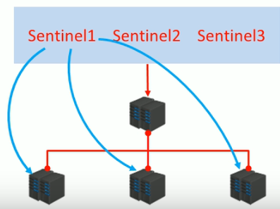

[toc]
# 1 哨兵模式介绍
在主从结构中，如果master宕机，那么就需要从slave中选择其中一个来充当master的角色，并且需要告诉其他slave新的master是谁。而这个过程，就需要哨兵来介入。

为完成这样的操作，有一下几点问题需要解决
1. 谁来确认master宕机了？
2. 怎么找到新的master？
3. 修改配置后，原始的master恢复了怎么办？

**哨兵**：哨兵（sentinel）是一个分布式系统，用于主从结构中的每台服务器进行监控，当出现故障时通过投票机制选择新的master并且将所有slave连接到新的master.

**哨兵的作用**:
  - 监控
    不断检查master和slave是否正常运行、master存活检测、master与slave运行情况检测。
  - 通知
    当监控的服务器出现问题时，向其他（哨兵、客户端）发送通知。
  - 自动故障转移
    断开故障master与slave连接，选取一个slave作为master,将其他slave连接到新的master, 并告知客户端新的服务器地址。

**注意**：
- 哨兵也是一个redis服务器，只是不提供数据服务
- 通常哨兵配置数量为单数---便于投票时票数不打平
